# AetherBridge - Minecraft 消息桥接系统

<div align="center">


[](https://github.com/DevCL/aetherbridge/actions)

[English](./README_en.md) | 简体中文

</div>

## 项目介绍

> AetherBridge 提供了一个简单而强大的方式来连接 Minecraft 服务器与外部通讯服务，支持实时双向消息传递。

AetherBridge 是一个用于 Minecraft 服务端的消息桥接系统，它允许 Minecraft 服务器与外部服务进行双向实时通信。该系统由两个主要部分组成：
1. Minecraft Fabric Mod（服务端）
2. Node.js 消息中转服务器

### 为什么选择 AetherBridge？

- 🚀 **简单易用**：安装即用，自动生成配置文件
- 🔒 **安全可靠**：完整的认证和错误处理机制
- 🔧 **高度可配置**：支持自定义几乎所有功能
- 📦 **开箱即用**：提供完整的 Node.js 服务器

### 主要功能
- 实时转发游戏内聊天消息到外部服务
- 接收外部消息并在游戏内广播
- 支持自定义消息前缀
- 支持 API 密钥验证
- 可配置的消息过滤
- 完整的错误处理和日志记录

### 核心特性

- 🔄 双向实时通信
  - 游戏内聊天消息实时转发到外部服务
  - 外部消息即时显示在游戏内

- 🛡️ 安全可靠
  - API密钥认证
  - IPv4/IPv6双栈支持
  - 自动重试机制

- ⚙️ 灵活配置
  - 功能独立开关
  - 配置热重载
  - 自定义消息前缀

- 📝 完整日志
  - 详细错误信息
  - 操作审计
  - 性能监控

## 系统架构

```mermaid
graph LR
    A[Minecraft 服务器] -->|消息发送| B[AetherBridge Mod]
    B -->|HTTP/API| C[Node.js 服务器]
    C -->|消息转发| D[外部服务]
    D -->|消息回传| C
    C -->|HTTP/API| B
    B -->|消息显示| A
```



### Minecraft Mod 部分
- 基于 Fabric 1.20.1
- 使用 Java 17
- 支持热重载配置
- 异步网络通信
- 支持IPv4/IPv6双栈

### Node.js 服务器部分
- Express.js 框架
- Winston 日志系统
- 环境变量配置
- RESTful API 设计
- 支持IPv4/IPv6访问

## 快速开始

### 前置要求

- Minecraft 1.20.1
- Fabric Loader >= 0.14.21
- Java 17 或更高版本
- Fabric API

### 安装步骤

1. 下载最新版本的mod
2. 放入服务器的mods目录
3. 启动服务器，mod将自动生成配置文件
4. 修改配置文件中的API密钥等设置
5. 使用 `/aetherbridge reload` 重新加载配置

### 基本使用

1. 游戏内发送消息
   - 所有玩家聊天消息将自动转发到配置的外部服务
   - 默认带有"游戏"前缀

2. 接收外部消息
   - 通过API发送消息到Minecraft
   - 支持自定义消息前缀

3. 管理命令
   - `/aetherbridge info` - 查看配置信息
   - `/aetherbridge reload` - 重载配置
   - `/aetherbridge feature list` - 查看功能列表

## 配置说明

### Minecraft Mod 配置
配置文件位置：`config/aetherbridge/config.json`
```json
{
    "apiUrl": "http://localhost:3000/api/mc-message",
    "apiKey": "your-secret-key",
    "listenPort": 8080,
    "features": {
        "messageSender": true,
        "messageReceiver": true
    }
}
```

### IPv6支持说明

1. 监听地址
   - mod默认监听所有IPv4和IPv6地址
   - 可以通过IPv4和IPv6地址访问API

2. 连接示例
   - IPv4: `http://127.0.0.1:8080/api/send-to-mc`
   - IPv6: `http://[::1]:8080/api/send-to-mc`
   - 域名: `http://example.com:8080/api/send-to-mc`

3. 注意事项
   - 确保服务器防火墙允许IPv6连接
   - 如果使用反向代理，需要正确配置IPv6转发
   - 建议在生产环境中使用域名，以便同时支持IPv4和IPv6

### Node.js 服务器配置
配置文件位置：`.env`
```env
PORT=3000
API_KEY=your-secret-key
MC_SERVER_HOST=localhost
MC_SERVER_PORT=8080
```

## API 文档

> 详细的 API 文档请查看：[API 文档](docs/api/README.md)

### 1. 发送消息到 Minecraft
- 端点：`POST /api/send`
- 认证：Bearer Token
- 请求体：
```json
{
    "message": "要发送的消息",
    "prefix": "系统"  // 可选，消息将显示为 [系统] 要发送的消息
}
```
- 响应：
```json
{
    "status": "success",
    "sent": {
        "message": "要发送的消息",
        "prefix": "系统",
        "time": "2024-01-20T12:34:56.789Z"
    }
}
```

### 消息格式说明

1. 从外部发送到Minecraft的消息格式：
   - 带前缀：`[前缀] 消息内容`
   - 不带前缀：直接显示`消息内容`

2. 示例：
```json
// 带前缀的消息
{
    "message": "南城：你好啊",
    "prefix": "QQ"
}
// 将在游戏中显示为：[QQ] 南城：你好啊

// 不带前缀的消息
{
    "message": "欢迎来到服务器"
}
// 将在游戏中显示为：欢迎来到服务器
```

3. 使用建议：
   - 用于标识消息来源：`[QQ]`, `[Discord]`, `[微信]`
   - 用于系统通知：`[系统]`, `[公告]`, `[活动]`
   - 用于管理命令：`[管理]`, `[后台]`

### 2. 接收 Minecraft 消息
- 端点：`POST /api/mc-message`
- 认证：Bearer Token
- 请求体：
```json
{
    "player": "玩家名称",
    "message": "聊天消息内容"
}
```
- 响应：
```json
{
    "status": "success",
    "received": {
        "player": "玩家名称",
        "message": "聊天消息内容",
        "time": "2024-01-20T12:34:56.789Z"
    }
}
```

### 3. 健康检查
- 端点：`GET /health`
- 响应：
```json
{
    "status": "ok",
    "timestamp": "2024-01-20T12:34:56.789Z"
}
```

### 消息验证
- 消息长度限制：256 字符
- 敏感词过滤：可配置
- Token 验证：必需

## 开发说明

1. 克隆仓库
```bash
git clone https://github.com/DevCL/aetherbridge.git
```

2. 设置开发环境
```bash
./gradlew genSources
./gradlew eclipse   # 对于Eclipse
./gradlew idea     # 对于IntelliJ IDEA
```

3. 构建mod
```bash
./gradlew build
```

## 性能说明

- 内存占用：< 50MB
- CPU 使用：< 1% (空闲时)
- 网络延迟：< 100ms (正常网络环境)
- 并发处理：每秒数百条消息

### 性能优化建议

1. 启用消息缓存
2. 调整连接池大小
3. 使用 CDN 加速
4. 开启 GZIP 压缩

## 安全建议

1. 修改默认 API 密钥
2. 使用 HTTPS 进行通信
3. 定期更新 API 密钥
4. 监控异常登录尝试
5. 设置适当的消息过滤规则

## 常见问题

1. Q: 配置文件不生效？
   A: 使用 `/aetherbridge reload` 重新加载配置

2. Q: 消息发送失败？
   A: 检查网络连接和 API 密钥配置

3. Q: 日志文件过大？
   A: 日志文件会自动轮转，每个文件最大 5MB

4. Q: 消息前缀显示异常？
   A: 确保前缀不包含特殊字符，长度适中

## 文档

- [完整文档](docs/README.md)
- [API文档](docs/api/README.md)
- [配置说明](docs/configuration.md)
- [故障排除](docs/troubleshooting.md)

## 问题反馈

如果你在使用过程中遇到问题：

1. 查看[故障排除指南](docs/troubleshooting.md)
2. 检查[常见问题](docs/troubleshooting.md#常见问题)
3. 提交[Issue](https://github.com/DevCL/aetherbridge/issues)

## 开发计划

- [ ] WebSocket 支持
- [ ] 消息队列
- [ ] 更多消息类型
- [ ] 自定义前缀样式
- [ ] 前缀权限控制
- [ ] 管理界面
- [ ] 数据库存储

## 更新日志

### v1.0.0 (2024-02-23)

- ✨ 首次发布
- 🎉 支持基本消息收发功能
- 🔒 添加安全认证机制
- 📝 完善文档和示例

[查看完整更新日志](CHANGELOG.md)

## 致谢

- [Fabric API](https://github.com/FabricMC/fabric) - Minecraft Mod 开发框架
- [Express](https://expressjs.com/) - Node.js Web 框架
- [Winston](https://github.com/winstonjs/winston) - 日志系统

## 支持项目

如果这个项目对你有帮助，欢迎：

- ⭐ 给项目点个星
- 🐛 提交 Bug 报告
- 💡 提供新功能建议
- 🌍 帮助改进文档

## 贡献指南

1. Fork 项目
2. 创建功能分支
3. 提交更改
4. 推送到分支
5. 创建 Pull Request

## 开源协议

本项目采用 CC0-1.0 许可证